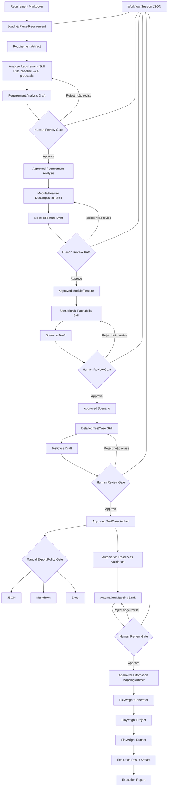
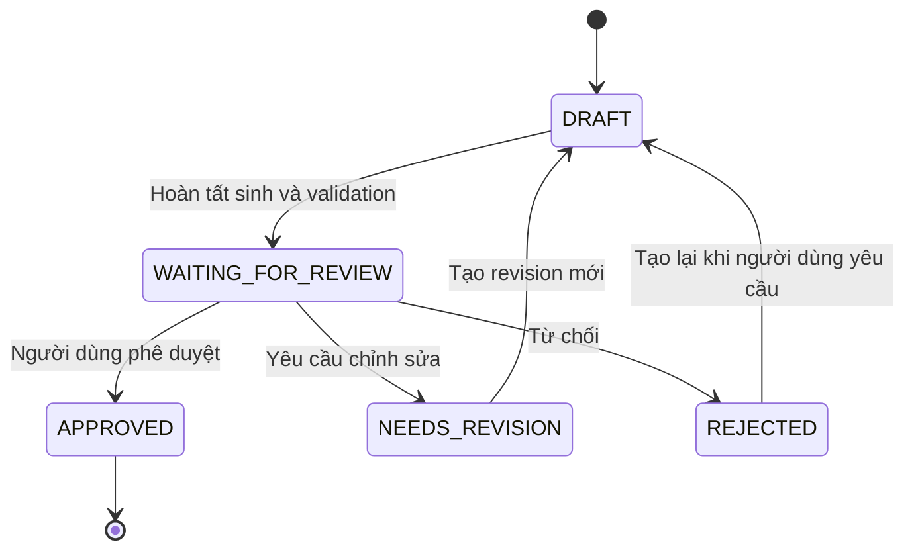

# QA Copilot V2 Architecture

## 1. Mục tiêu

QA Copilot V2 hỗ trợ QA chuyển requirement dạng Markdown thành manual test case có cấu trúc, automation mapping được duyệt, mã Playwright có thể thực thi và báo cáo kết quả truy vết được. Hệ thống kết hợp baseline sinh bằng rule với đề xuất từ AI, nhưng quyền quyết định cuối cùng luôn thuộc về người dùng.

Mục tiêu của kiến trúc:

- Rút ngắn thời gian phân tích requirement và chuẩn bị test case.
- Tách dữ liệu trung gian khỏi cách hiển thị bằng cách sử dụng JSON làm dữ liệu chuẩn.
- Bảo toàn module, feature, requirement reference, source và metadata xuyên suốt pipeline.
- Bắt buộc Human Review Gate tại các quyết định quan trọng.
- Cho phép dừng và tiếp tục workflow mà không cần chạy lại từ đầu.
- Sinh và chạy Playwright JavaScript từ automation mapping đã được người dùng phê duyệt.
- Lưu Execution Result Artifact để truy vết kết quả chạy về testcase, scenario và requirement nguồn.
- Tái sử dụng có chọn lọc code hiện tại để có thể triển khai MVP trong khoảng 10 ngày làm việc.

Phạm vi MVP gồm một workflow duy nhất: **Generate Test Cases và Playwright Automation**. Requirement đầu vào là Markdown; review được thực hiện qua JSON/CLI; AI provider ưu tiên Ollama. MVP tạo manual testcase, xuất JSON/Markdown/Excel, tạo automation mapping có review, sinh Page Object và Playwright JavaScript cơ bản, chạy bằng Chromium, rồi xuất Execution Result JSON và báo cáo cơ bản. Kiến trúc không sử dụng microservice hoặc database trong MVP.

## 2. Nguyên tắc kiến trúc

1. **AI-assisted, human-controlled:** AI hỗ trợ phân tích và đề xuất, không tự quyết định nội dung cuối cùng.
2. **Artifact-first:** Mỗi stage nhận Artifact làm input và tạo Draft Artifact làm output.
3. **Approved-only progression:** Chỉ Artifact có trạng thái `APPROVED` mới được chuyển sang stage tiếp theo.
4. **Deterministic baseline:** Rule Engine luôn tạo được baseline khi AI bị tắt, lỗi hoặc không khả dụng.
5. **Không tự động merge AI vào approved data:** Đề xuất AI phải nằm trong draft và được người dùng duyệt rõ ràng.
6. **JSON canonical:** JSON là hợp đồng dữ liệu nội bộ; Markdown, Excel, CSV và Playwright là dữ liệu dẫn xuất.
7. **Traceability by default:** Artifact phải giữ liên kết đến input, requirement, module, feature và nguồn sinh.
8. **Separation of concerns:** Workflow điều phối; Skill thực hiện năng lực; Rule kiểm tra; Reference cung cấp tri thức; Provider chỉ giao tiếp với AI.
9. **Immutability theo revision:** Nội dung đã được duyệt không bị ghi đè. Chỉnh sửa tạo revision mới và giữ lịch sử liên kết.
10. **Thiết kế vừa đủ:** MVP dùng file JSON và CLI, không xây workflow engine tổng quát hoặc plugin platform.
11. **Automation-ready canonical data:** Manual testcase và automation dùng chung một canonical testcase payload; automation metadata là phần mở rộng có cấu trúc.
12. **Structured mapping:** Locator, action, value reference và assertion phải được biểu diễn có cấu trúc và qua validation.
13. **Không sinh automation từ natural language trực tiếp:** Natural-language description phục vụ manual review, không đủ để Playwright Generator tự suy diễn.
14. **Generated code là dữ liệu dẫn xuất:** Playwright code không phải nguồn dữ liệu chuẩn và có thể được sinh lại từ Approved Automation Mapping Artifact.
15. **User-approved locators:** Locator phải đến từ Reference hoặc được người dùng xác nhận; AI chỉ được đề xuất locator draft.

## 3. Kiến trúc tổng thể

Sơ đồ dưới đây mô tả **kiến trúc mục tiêu**. Pipeline hiện tại chưa có Artifact persistence, Review Gate và pause/resume đầy đủ.



## 4. Thành phần chính

### 4.1 Artifact

- **Trách nhiệm:** Đóng gói dữ liệu của một stage cùng định danh, trạng thái, revision, provenance và thông tin review.
- **Input:** Payload do loader, Skill hoặc người dùng cung cấp; liên kết đến các Artifact đầu vào.
- **Output:** JSON có Artifact envelope chuẩn.
- **Không được làm:** Tự gọi AI, chạy business rule, tự phê duyệt hoặc âm thầm thay đổi Artifact đã `APPROVED`.

### 4.2 Workflow

- **Trách nhiệm:** Điều phối đúng thứ tự stage của Generate Manual Test Cases; kiểm tra trạng thái input; lưu session; pause và resume.
- **Input:** Workflow Session và Artifact đã được phép chuyển tiếp.
- **Output:** Trạng thái session mới, lệnh chạy stage tiếp theo hoặc trạng thái đang chờ review.
- **Không được làm:** Chứa prompt chuyên môn, trực tiếp phân tích requirement, tự sửa payload hoặc bỏ qua Review Gate.

### 4.3 Stage

- **Trách nhiệm:** Xác định một bước hữu hạn gồm loại input, Skill, Rule, loại output và điều kiện chuyển tiếp.
- **Input:** Một hoặc nhiều Artifact đúng loại và đúng trạng thái.
- **Output:** Draft Artifact hoặc kết quả validation của stage.
- **Không được làm:** Tự chọn stage kế tiếp ngoài định nghĩa Workflow hoặc xuất dữ liệu chưa approved.

### 4.4 Skill

- **Trách nhiệm:** Thực hiện một năng lực cụ thể như phân tích requirement, decomposition, sinh scenario hoặc sinh test case.
- **Input:** Payload từ Artifact, Reference liên quan và tùy chọn AI Provider.
- **Output:** Dữ liệu đề xuất có cấu trúc để Workflow đóng gói thành Draft Artifact.
- **Không được làm:** Tự phê duyệt, tự chuyển stage, tự ghi đè Artifact nguồn hoặc phụ thuộc trực tiếp vào exporter.

Trong MVP, Skill là contract nội bộ quanh các engine/analyzer/generator hiện có, không phải plugin platform.

### 4.5 Rule

- **Trách nhiệm:** Tạo baseline deterministic và kiểm tra tính hợp lệ, đầy đủ, nhất quán, ownership và traceability của payload.
- **Input:** Payload của Artifact và Reference áp dụng.
- **Output:** Dữ liệu baseline hoặc danh sách lỗi/cảnh báo có mã và vị trí.
- **Không được làm:** Gọi AI, tự sửa nội dung đã approved hoặc đưa ra quyết định review thay người dùng.

### 4.6 Reference

- **Trách nhiệm:** Cung cấp checklist, quy ước, domain knowledge và hướng dẫn dùng chung cho Rule/Skill.
- **Input:** Tài liệu được quản lý theo tên và phiên bản.
- **Output:** Nội dung tham chiếu chỉ đọc trong một lần chạy stage.
- **Không được làm:** Chứa trạng thái workflow, secret, dữ liệu review hoặc code điều phối.

### 4.7 Review Gate

- **Trách nhiệm:** Dừng pipeline, trình bày Draft Artifact, tiếp nhận chỉnh sửa/nhận xét và ghi quyết định của người dùng.
- **Input:** Artifact ở trạng thái `WAITING_FOR_REVIEW`.
- **Output:** Revision `APPROVED`, `REJECTED` hoặc `NEEDS_REVISION`, kèm reviewer và nhận xét.
- **Không được làm:** Tự động approve, coi AI confidence là phê duyệt hoặc thay đổi payload mà không tạo revision rõ ràng.

### 4.8 Workflow Session

- **Trách nhiệm:** Theo dõi `sessionId`, workflow, current stage, Artifact IDs, trạng thái chờ, thời điểm cập nhật và lỗi có thể resume.
- **Input:** Sự kiện bắt đầu, hoàn tất stage, review, lỗi hoặc resume.
- **Output:** File JSON session được cập nhật nguyên tử.
- **Không được làm:** Chứa API key, sao chép toàn bộ payload Artifact hoặc thay Artifact làm nguồn dữ liệu chuẩn.

### 4.9 AI Provider

- **Trách nhiệm:** Nhận prompt, gọi mô hình được cấu hình và trả response thô cùng metadata trạng thái.
- **Input:** Prompt đã được Skill xây dựng và cấu hình timeout/provider.
- **Output:** Response hoặc lỗi được chuẩn hóa để Skill xử lý.
- **Không được làm:** Biết thứ tự Workflow, tự lưu Artifact, tự merge vào approved data, gọi exporter hoặc chứa business rule.

### 4.10 Exporter

- **Trách nhiệm:** Chuyển canonical payload của Approved TestCase Artifact sang JSON, Markdown, Excel hoặc CSV.
- **Input:** Approved TestCase Artifact đã qua Export Policy Gate.
- **Output:** File ở định dạng yêu cầu và kết quả xuất.
- **Không được làm:** Gọi AI, sinh thêm nghiệp vụ, sửa test case, suy diễn field còn thiếu hoặc nhận Draft Artifact.

### 4.11 Automation Mapping

- **Trách nhiệm:** Chuyển Approved TestCase thành cấu trúc action, target, locator, value và assertion; giữ traceability về testcase và step nguồn.
- **Input:** Approved TestCase Artifact, Locator Reference, Test Data Reference và thông tin page/route.
- **Output:** Automation Mapping Draft hoặc Approved Automation Mapping Artifact sau review.
- **Không được làm:** Tự approve, tự bịa locator, tự chạy Playwright hoặc sửa testcase đã approved.

### 4.12 Playwright Generator

- **Trách nhiệm:** Sinh Playwright spec, Page Object, test data và locator mapping từ Approved Automation Mapping Artifact.
- **Input:** Approved Automation Mapping Artifact.
- **Output:** Playwright project hoặc tập generated files có manifest truy vết.
- **Không được làm:** Gọi AI để thay đổi nghiệp vụ, thêm testcase, đổi expected result, đoán locator còn thiếu hoặc nhận Draft Artifact.

### 4.13 Playwright Runner

- **Trách nhiệm:** Chạy generated Playwright tests và thu thập pass, fail, error, screenshot, trace cùng execution metadata.
- **Input:** Generated Playwright project và runtime configuration đã kiểm tra.
- **Output:** Execution Result Artifact.
- **Không được làm:** Sửa generated testcase, requirement hoặc manual testcase; tự sửa test để đổi kết quả; tự approve execution result.

### 4.14 Execution Result Artifact

- **Trách nhiệm:** Lưu kết quả kỹ thuật bất biến và traceability tới testcase, automation mapping và generated project.
- **Input:** Kết quả từ Playwright Runner.
- **Output:** Canonical execution result JSON và báo cáo dẫn xuất.
- **Không được làm:** Thay đổi testcase nguồn hoặc đánh dấu pass khi runner không trả kết quả tương ứng.

## 5. Luồng Generate Test Cases và Playwright Automation

| # | Stage | Input Artifact | Skill | Rule | Output Artifact | Dừng/chuyển tiếp |
|---|---|---|---|---|---|---|
| 1 | Load Requirement | File Markdown | Requirement loading/parsing | Kiểm tra file, cấu trúc và dữ liệu bắt buộc | Requirement Artifact | Tạo `DRAFT`, validate thành công thì dùng nội bộ cho stage 2; lỗi thì dừng |
| 2 | Analyze Requirement | Requirement Artifact | Requirement Analysis | Rule-based intelligence baseline; kiểm tra ownership và traceability | Requirement Analysis Draft | Chuyển `WAITING_FOR_REVIEW` |
| 3 | Review Questions và Requirement Analysis | Requirement Analysis Draft | Không chạy Skill sinh mới; người dùng trả lời/chỉnh sửa | Kiểm tra câu trả lời và payload review | Approved Requirement Analysis | `APPROVED` sang stage 4; `REJECTED`/`NEEDS_REVISION` quay lại stage 2 |
| 4 | Decompose Module/Feature | Approved Requirement Analysis | Module/Feature Decomposition | Tên có nghĩa, không trùng, giữ source reference | Module/Feature Draft | Chuyển `WAITING_FOR_REVIEW` |
| 5 | Review Module/Feature | Module/Feature Draft | Người dùng duyệt hoặc chỉnh danh sách | Kiểm tra module/feature ownership và uniqueness | Approved Module/Feature | `APPROVED` sang stage 6; trạng thái khác quay lại stage 4 |
| 6 | Generate Scenario Draft | Approved Module/Feature và Approved Requirement Analysis | Scenario/Traceability Generation | Baseline positive, negative, boundary, security, permission; kiểm tra mapping nguồn | Scenario Draft | Chuyển `WAITING_FOR_REVIEW` |
| 7 | Review Scenario | Scenario Draft | Người dùng sửa, thêm, bỏ và duyệt scenario | Kiểm tra title, type, module, feature và requirement reference | Approved Scenario | `APPROVED` sang stage 8; trạng thái khác quay lại stage 6 |
| 8 | Generate TestCase Draft | Approved Scenario | Detailed TestCase Generation và enrichment | Kiểm tra testData, steps, expected results, assertions và traceability | TestCase Draft | Chuyển `WAITING_FOR_REVIEW` |
| 9 | Review TestCase | TestCase Draft | Người dùng duyệt nội dung chi tiết | Kiểm tra canonical payload và dữ liệu bắt buộc | Approved TestCase Artifact | `APPROVED` sang stage 10; trạng thái khác quay lại stage 8 |
| 10 | Export Manual TestCase | Approved TestCase Artifact | Manual export | Export Policy Gate xác minh đúng loại và `APPROVED` | JSON/Markdown/Excel, CSV nếu giữ | Có thể chạy lại; không thay đổi Artifact và không thay thế stage 11–17 |
| 11 | Validate Automation Readiness | Approved TestCase Artifact | Automation readiness validation | Kiểm tra structured action, locator, data reference và assertion | Readiness result trong Automation Mapping Draft | Có blocker thì dừng; không được tự bỏ qua |
| 12 | Generate Automation Mapping Draft | Approved TestCase Artifact và references | Automation mapping | Action/locator/valueRef/assertion thuộc danh sách hỗ trợ và giữ traceability | Automation Mapping Draft | Chuyển `WAITING_FOR_REVIEW` |
| 13 | Review Automation Mapping | Automation Mapping Draft | Người dùng kiểm tra/sửa mapping | Locator phải có Reference hoặc xác nhận; không còn blocker | Approved Automation Mapping Artifact | `APPROVED` sang stage 14; trạng thái khác quay lại stage 12 |
| 14 | Generate Playwright | Approved Automation Mapping Artifact | Playwright generation | Chỉ dùng mapping approved; kiểm tra generated syntax | Playwright Project Artifact và generated files | Lỗi generation/syntax thì dừng, không tự sửa nghiệp vụ |
| 15 | Run Playwright | Playwright Project Artifact | Playwright Runner adapter | Kiểm tra runtime config và project manifest | Raw execution output | Luôn chuyển kết quả kỹ thuật sang stage 16, kể cả fail/error |
| 16 | Create Execution Result | Raw execution output và source Artifact IDs | Execution result collection | Chuẩn hóa pass/fail/error và kiểm tra traceability | Immutable Execution Result Artifact | Chuyển stage 17 khi Artifact hợp lệ |
| 17 | Export Execution Report | Execution Result Artifact | Execution report export | Không thay đổi kết quả runner | Execution Result JSON và report cơ bản | Hoàn tất workflow hoặc ghi lỗi export có thể chạy lại |

AI có thể được gọi trong stage 2, 4, 6 hoặc 8 như một nguồn đề xuất tùy cấu hình. Mọi đề xuất AI vẫn nằm trong Draft Artifact tương ứng và không làm thay đổi điều kiện review.

Stage 11–17 là phần bắt buộc của MVP. Testcase không automation-ready phải được đánh dấu blocker và workflow dừng tại readiness/mapping review cho đến khi người dùng xử lý; hệ thống không tự bỏ qua blocker.

## 6. Artifact lifecycle



- `DRAFT`: Dữ liệu đang được tạo hoặc chỉnh sửa, chưa được dùng làm quyết định cuối.
- `WAITING_FOR_REVIEW`: Draft đã qua validation tối thiểu và pipeline phải dừng.
- `NEEDS_REVISION`: Người dùng yêu cầu sửa; stage tạo revision mới thay vì ghi đè bản cũ.
- `REJECTED`: Bản đề xuất bị từ chối và không được chuyển tiếp.
- `APPROVED`: Bản revision cụ thể đã được người dùng chấp thuận.

Chỉ `APPROVED` được dùng làm input cho stage tiếp theo. Mọi thay đổi payload sau approval làm mất hiệu lực approval của nội dung mới và phải tạo revision `DRAFT`.

Lifecycle review này áp dụng cho Requirement Analysis Artifact, Module/Feature Artifact, Scenario Artifact, TestCase Artifact và Automation Mapping Artifact. Execution Result Artifact không cần Human Review trước khi được tạo vì đây là kết quả kỹ thuật từ runner; Artifact này phải immutable, traceable và không được dùng để tự sửa testcase nguồn.

## 7. Artifact envelope

Ví dụ tối thiểu:

```json
{
  "artifactId": "ART-TC-0001",
  "workflowId": "generate-manual-test-cases",
  "sessionId": "SES-20260727-0001",
  "artifactType": "TESTCASE",
  "stage": "GENERATE_TESTCASE",
  "status": "WAITING_FOR_REVIEW",
  "revision": 1,
  "inputArtifactIds": ["ART-SC-0001"],
  "createdAt": "2026-07-27T09:00:00.000Z",
  "updatedAt": "2026-07-27T09:05:00.000Z",
  "reviewedAt": null,
  "approvedAt": null,
  "payload": {
    "module": "Thiết bị",
    "testCases": []
  },
  "reviewComments": [],
  "metadata": {
    "createdBy": "RULE_BASELINE",
    "aiProvider": "OLLAMA",
    "schemaVersion": "1.0"
  }
}
```

Các `artifactType` trong workflow mục tiêu:

- `REQUIREMENT`
- `REQUIREMENT_ANALYSIS`
- `MODULE_FEATURE`
- `SCENARIO`
- `TESTCASE`
- `AUTOMATION_MAPPING`
- `PLAYWRIGHT_PROJECT`
- `EXECUTION_RESULT`

`payload` thay đổi theo `artifactType`; envelope giữ ổn định. Tùy Artifact, `metadata` có thể chứa `schemaVersion`, `generatorVersion`, `framework`, `sourceArtifactIds`, `environment` và `browser`. Metadata AI chỉ ghi tên provider và trạng thái cần thiết, không ghi prompt đầy đủ, response đầy đủ hoặc secret.

## 8. Canonical TestCase Payload

Manual testcase và automation dùng chung một canonical JSON. Markdown và Excel chỉ trình bày các trường manual cần thiết; Playwright sử dụng phần automation metadata có cấu trúc. Hệ thống không duy trì hai bộ testcase nghiệp vụ riêng biệt.

```json
{
  "id": "TC-DEVICE-CREATE-001",
  "module": "Thiết bị",
  "feature": "Thêm thiết bị",
  "scenarioId": "SC-DEVICE-CREATE-001",
  "title": "Thêm thiết bị với dữ liệu hợp lệ",
  "type": "POSITIVE",
  "priority": "HIGH",
  "preconditions": [],
  "testData": {},
  "steps": [
    {
      "order": 1,
      "description": "Nhập mã thiết bị",
      "action": "fill",
      "target": {
        "field": "Mã thiết bị",
        "locatorKey": "deviceCodeInput"
      },
      "valueRef": "device.code"
    }
  ],
  "expectedResults": [
    {
      "description": "Hiển thị thông báo thành công",
      "assertion": "toBeVisible",
      "target": {
        "locatorKey": "successMessage"
      },
      "expectedValue": "Thêm thiết bị thành công"
    }
  ],
  "sourceReferences": [],
  "automation": {
    "candidate": true,
    "readiness": "READY",
    "framework": "PLAYWRIGHT",
    "blockers": []
  }
}
```

- `description` phục vụ manual review và các manual exporter.
- `action`, `target`, `locatorKey` và `valueRef` phục vụ automation mapping.
- Excel không bắt buộc hiển thị toàn bộ automation metadata và không thay đổi các cột manual hiện tại chỉ vì bổ sung automation.
- Artifact envelope bọc canonical payload phục vụ workflow; downstream có thể export riêng canonical payload.
- JSON exporter không được làm mất metadata automation. Existing exporter sẽ được bọc adapter ở sprint sau.

## 9. Automation Mapping Artifact

Payload tối thiểu gồm:

- `testCaseId`
- `pageObject`
- `route`
- `actions`
- `assertions`
- `locatorReferences`
- `dataReferences`
- `setup`
- `teardown`
- `automationReadiness`
- `blockers`

Ví dụ action:

```json
{
  "stepId": "STEP-001",
  "action": "fill",
  "locatorKey": "deviceCodeInput",
  "valueRef": "device.code"
}
```

Ví dụ locator reference:

```json
{
  "locatorKey": "deviceCodeInput",
  "strategy": "getByTestId",
  "value": "device-code"
}
```

Locator phải đến từ Locator Reference hoặc được người dùng xác nhận. AI chỉ được đề xuất locator draft; locator chưa được xác nhận là blocker. Playwright Generator không được bịa locator hoặc nhận mapping chưa approved.

## 10. Ranh giới AI và Rule Engine

Rule Engine:

- Tạo baseline deterministic từ requirement đã parse.
- Bảo toàn module, feature, IDs, rule code, source và traceability.
- Kiểm tra schema, ownership, duplicate và field bắt buộc.
- Vẫn chạy khi AI timeout, trả JSON lỗi hoặc không khả dụng.

AI:

- Đề xuất cách hiểu requirement, ambiguity, câu hỏi, risk, negative case và nội dung chi tiết.
- Có thể đề xuất action type, assertion type, page object grouping, locator candidate và test data mapping.
- Chỉ tạo phần đề xuất trong Draft Artifact.
- Không được thay thế âm thầm baseline rule-derived.
- Không được tự gắn trạng thái `APPROVED`.
- Không được sinh code cuối cùng từ thông tin chưa approved; locator candidate luôn phải qua review.

Người dùng:

- Xem được nguồn của baseline và đề xuất.
- Có quyền chỉnh sửa, thêm, bỏ hoặc từ chối đề xuất AI.
- Quyết định revision nào được phê duyệt.

Không tự merge AI output vào approved payload. Nếu cần hỗ trợ so sánh, Draft Artifact có thể lưu các vùng `baseline` và `proposals`; canonical payload chỉ hình thành sau thao tác review rõ ràng.

Với automation, Rule Engine kiểm tra action thuộc danh sách hỗ trợ, locator reference tồn tại, `valueRef` trỏ tới dữ liệu hợp lệ và assertion tương thích. Thiếu bất kỳ thành phần bắt buộc nào thì readiness không được là `READY`.

## 11. Chiến lược tái sử dụng code hiện tại

### Reuse gần như nguyên trạng

- `RequirementLoader`
- `MarkdownParser`, `MarkdownTableParser`, `DataDefinitionParser`
- Các model requirement và test hiện có
- `AIProvider`, `AIProviderFactory`, `OllamaProvider`, `OpenAIProvider`
- `JsonExporter`, `MarkdownExporter`, `ExcelExporter`, `CsvExporter`

Các thành phần này vẫn cần được gọi qua boundary mới, nhưng trách nhiệm lõi có thể giữ lại.

### Reuse sau khi bọc bằng contract

- `RequirementIntelligenceEngine` và các analyzer: bọc thành Requirement Analysis Skill/Rule baseline.
- `ScenarioRecommendationEngine`: bọc thành Scenario Generation Skill.
- `ScenarioEnrichmentEngine` và enrichers: bọc trong Detailed TestCase Skill.
- `IntelligenceScenarioGenerator`, `TestCaseGenerator`: chỉ nhận dữ liệu từ Approved Scenario hoặc tạo Draft TestCase, tùy stage.
- `RequirementValidator`: mở rộng vai trò thông qua Rule contract theo từng artifact.
- `OutputManager`: đặt sau Export Policy Gate.
- `TraceabilityReportGenerator`: nhận canonical approved payload và Artifact references.
- `AIAnalysisEngine`: tách kết quả thành proposal, không merge trực tiếp vào knowledge được phê duyệt.
- `TestCase` model: cần được bọc/mở rộng contract để giữ automation metadata mà không làm mất các trường manual.
- `TestStep` model: cần hỗ trợ `action`, `target` và `valueRef` có cấu trúc.
- `TestData` model: cần hỗ trợ reference path dùng bởi automation mapping.
- Các exporter hiện có: cùng đọc canonical payload; adapter sprint sau quyết định trường manual nào được trình bày.
- `OutputManager`: cần hỗ trợ Playwright output qua policy gate mà không trộn business logic.

Các component **chưa tồn tại và cần xây mới trong MVP**:

- `AutomationReadinessValidator`
- `AutomationMappingArtifact`
- `PlaywrightGenerator`
- Playwright Runner adapter
- `ExecutionResultArtifact`
- `LocatorReference`

Danh sách trên là định hướng triển khai, không phải tuyên bố về hiện trạng code.

### Legacy hoặc cần thay thế dần

- Pipeline tuyến tính trong `QACopilot` cần được thay dần bằng Workflow có checkpoint.
- `TestScenarioGenerator.js` trùng/không nhất quán vai trò với `TestCaseGenerator`.
- `src/ai/AIClient.js`, `PromptBuilder.js`, `AIResponseParser.js` chồng lấn với `AIAnalysisEngine` và provider flow.
- `prompts/RequirementAnalysisPrompt.js` là prompt flow song song ngoài `src`.
- `src/reports/TraceabilityReport.js` chồng lấn một phần với model và generator traceability.
- Các generator/template generic cũ chỉ giữ trong thời gian regression nếu pipeline mới chưa thay thế hoàn toàn.

Sprint này không di chuyển, đổi tên hoặc xóa các file trên.

### Chưa xử lý trong MVP

- Plugin marketplace và Skill động.
- Web UI và cộng tác nhiều người.
- Database, distributed processing và background queue.
- Multi-browser đầy đủ, visual regression, API automation, performance và security testing chuyên sâu.

## 12. Persistence và pause/resume

MVP sử dụng file JSON:

- Mỗi Artifact/revision được lưu thành một file riêng.
- Workflow Session được lưu thành JSON riêng và tham chiếu Artifact bằng ID.
- Khi stage tạo draft xong, session chuyển sang trạng thái chờ review và tiến trình kết thúc bình thường.
- CLI review cập nhật quyết định bằng cách tạo hoặc hoàn tất revision phù hợp.
- Resume nhận `sessionId`, đọc session, xác minh Artifact và tiếp tục tại stage hợp lệ tiếp theo.
- Export thất bại có thể chạy lại từ Approved TestCase Artifact mà không sinh lại test case.
- Automation Mapping Artifact và Execution Result Artifact được lưu thành JSON.
- Generated Playwright project có manifest tham chiếu `sourceArtifactIds`.
- Có thể chạy lại Playwright từ Approved Automation Mapping Artifact mà không sinh lại manual testcase.
- Có thể regenerate code khi template thay đổi vì JSON Artifact, không phải generated code, là nguồn chuẩn.

Ghi file nên dùng thao tác thay thế nguyên tử để giảm nguy cơ JSON dở dang. Không cần database, locking phân tán hoặc xử lý multi-user trong MVP.

## 13. Export policy

Nhóm manual output:

- JSON
- Markdown
- Excel
- CSV nếu tiếp tục duy trì

Nhóm automation output:

- Playwright spec
- Page Object
- Test data
- Locator mapping
- Execution Result JSON
- Execution report

Quy định:

1. Manual exporter chỉ nhận Approved TestCase Artifact.
2. Playwright Generator chỉ nhận Approved Automation Mapping Artifact.
3. Execution report exporter chỉ nhận Execution Result Artifact.
4. Approval áp dụng cho revision cụ thể; revision draft mới không kế thừa approval.
5. JSON là canonical payload; Markdown, Excel và CSV không duy trì mô hình nghiệp vụ riêng.
6. Không exporter/generator nào gọi AI, tự thêm nghiệp vụ hoặc sửa nội dung nguồn.
7. Generated Playwright code phải giữ traceability tới testcase ID và automation mapping revision.
8. Output phải giữ ID, module, feature, traceability, metadata và thứ tự testcase.

## 14. Error handling và fallback

| Trường hợp | Hành vi |
|---|---|
| AI timeout | Ghi lỗi ngắn gọn, không ghi prompt/secret; dùng rule-based baseline và tiếp tục tạo draft |
| AI trả JSON lỗi hoặc không dùng được | Loại bỏ proposal lỗi, giữ baseline; Draft ghi provenance rằng AI fallback |
| Provider không khả dụng | Chuyển sang rule-only; không làm pipeline thất bại nếu baseline hợp lệ |
| Requirement không hợp lệ | Dừng trước analysis, lưu validation errors; không tạo Artifact downstream |
| Artifact chưa approved | Workflow dừng và báo stage/revision đang chờ; tuyệt đối không chuyển tiếp |
| Artifact sai loại hoặc thiếu input link | Dừng stage với lỗi contract, không tự đoán hoặc sửa ownership |
| Export thất bại | Giữ Approved Artifact; ghi kết quả lỗi để có thể export lại |
| File session/artifact hỏng | Không ghi đè; báo lỗi đọc/validation và yêu cầu phục hồi hoặc chọn revision hợp lệ |
| Testcase thiếu structured action | Đánh dấu blocker; dừng tại readiness/mapping review |
| Locator chưa xác nhận hoặc không tồn tại | Không đặt `READY`; yêu cầu Reference hoặc user approval |
| `valueRef` không tồn tại | Đánh dấu blocker, không sinh code dùng giá trị đoán |
| Unsupported Playwright action/assertion | Validation lỗi; yêu cầu sửa mapping |
| Generated code syntax error | Dừng trước runner và báo lỗi generation |
| Browser launch hoặc Playwright runtime failure | Tạo Execution Result Artifact trạng thái `ERROR` |
| Application unavailable | Tạo kết quả `ERROR` có environment metadata |
| Assertion failure | Tạo kết quả `FAILED`; không tự sửa test thành pass |

Rule-only vẫn sinh manual testcase khi AI lỗi. Fallback chỉ thay cách tạo đề xuất, không bỏ qua Human Review Gate. Automation không được tuyên bố `READY` nếu thiếu locator, action, data hoặc assertion; workflow phải dừng tại mapping review cho đến khi blocker được xử lý.

## 15. Security và dữ liệu nhạy cảm

- Không lưu API key, password, token hoặc nội dung `.env` vào Artifact, session, output hay log.
- Không đọc hoặc export `.env` như requirement/reference.
- Prompt chỉ chứa dữ liệu cần thiết cho stage; loại bỏ secret và dữ liệu nhạy cảm không phục vụ phân tích.
- Log phải che credential, authorization header và giá trị nhạy cảm.
- Không ghi toàn bộ prompt hoặc raw AI response vào log mặc định.
- File Artifact/session cần được lưu trong vùng dự án được kiểm soát, với tên file được chuẩn hóa để tránh path traversal.
- Review comment cũng được xem là dữ liệu dự án và không được tự động gửi sang provider ở stage sau.

## 16. Phạm vi MVP và ngoài phạm vi

### Trong MVP

- Một workflow Generate Manual Test Cases.
- Requirement Markdown.
- Human Review Gate bắt buộc cho analysis/questions, module/feature, scenario và test case.
- Artifact và Workflow Session lưu bằng JSON.
- Rule-based baseline.
- Ollama là provider ưu tiên; provider khác đi qua abstraction hiện có.
- Pause/resume bằng `sessionId`.
- Export JSON, Markdown và Excel từ Approved TestCase Artifact.
- Automation Readiness Validation và Automation Mapping Review.
- Sinh Playwright JavaScript, Page Object và test data cơ bản.
- Chạy Playwright bằng Chromium.
- Thu thập pass, fail và error.
- Execution Result JSON và báo cáo cơ bản.
- CLI/JSON review, không yêu cầu web UI.

### Ngoài MVP hiện tại

- Web UI hoàn chỉnh.
- Multi-user và phân quyền review.
- Database.
- Plugin marketplace.
- Workflow engine tổng quát.
- Distributed processing.
- Multi-browser đầy đủ và mobile emulation chuyên sâu.
- Visual regression.
- Parallel/distributed execution.
- Self-healing locator hoặc AI tự sửa test.
- CI/CD hoàn chỉnh.
- Performance test.
- Security test chuyên sâu.
- API automation đầy đủ.

## 17. Roadmap sau báo cáo

1. Multi-browser và chiến lược execution trên nhiều môi trường.
2. Tích hợp CI/CD.
3. Visual regression.
4. Sinh API test từ contract/API specification.
5. Self-healing locator có Human Review.
6. UI review hỗ trợ diff baseline, AI proposal và user revision.
7. So sánh version requirement/artifact để phân tích impact.
8. Execution history dashboard.
9. Cân nhắc persistence/database và multi-user khi có nhu cầu thực tế.

## 18. Architectural decisions

| Decision | Lựa chọn | Lý do |
|---|---|---|
| Canonical data | JSON | Dễ validate, lưu revision, resume và làm nguồn chung cho exporter |
| Quyền quyết định | Human review bắt buộc | Ngăn AI tự đưa đề xuất vào testcase cuối cùng |
| Đơn vị trao đổi | Artifact-first | Tạo boundary rõ, provenance và khả năng pause/resume |
| Điều kiện chuyển stage | Approved-only | Bảo đảm chỉ dữ liệu được duyệt đi tiếp |
| Persistence MVP | File JSON trước database | Triển khai nhanh, dễ demo và phù hợp single-user |
| AI failure strategy | Rule-based baseline | Pipeline vẫn hữu dụng khi provider lỗi |
| Provider integration | Provider abstraction độc lập | Cho phép ưu tiên Ollama và đổi provider mà không đổi Workflow |
| Export | Từ một Approved TestCase payload | Tránh khác biệt nghiệp vụ giữa JSON, Markdown, Excel và CSV |
| Tái sử dụng V2 | Có chọn lọc và bọc contract | Giảm rủi ro, giữ regression behavior nhưng tạo boundary mới |
| Review interface | CLI/JSON trong MVP | Đủ để chứng minh workflow mà không tốn thời gian xây web UI |
| Workflow count | Một workflow testcase và Playwright automation | Tập trung mục tiêu báo cáo, tránh framework tổng quát |
| Deployment architecture | Một ứng dụng Node.js, không microservice | Phù hợp quy mô và thời gian triển khai |
| Phạm vi thiết kế | Không over-engineering trước báo cáo | Ưu tiên end-to-end demo có kiểm soát trong khoảng 10 ngày |
| Automation framework | Playwright JavaScript | Phù hợp project Node.js hiện tại và mục tiêu demo |
| Automation source | Approved Automation Mapping Artifact | Ngăn sinh code từ dữ liệu chưa duyệt |
| Locator policy | Reference hoặc user-approved locator | Tránh AI bịa locator |
| Manual và automation model | Một canonical testcase payload | Tránh lệch nghiệp vụ giữa hai output |
| Code regeneration | Generated code có thể sinh lại | JSON Artifact mới là nguồn chuẩn |
| MVP browser | Chromium | Giảm phạm vi nhưng vẫn chứng minh end-to-end |

## 19. Definition of Done cho Architecture

Architecture được xem là hoàn tất khi:

- Mô tả được luồng end-to-end từ Requirement Markdown đến các output.
- Có bốn Human Review Gate bắt buộc tại đúng điểm quyết định.
- Có Artifact lifecycle và điều kiện chuyển trạng thái rõ ràng.
- Có Artifact envelope đủ định danh, revision, provenance và review.
- Có ranh giới trách nhiệm giữa Workflow, Stage, Skill, Rule, Reference, Provider và Exporter.
- Chỉ Approved Artifact được chuyển stage và chỉ Approved TestCase Artifact được export.
- Rule-based baseline vẫn hoạt động khi AI lỗi hoặc bị tắt.
- AI output được xác định là draft/proposal, không tự merge vào approved data.
- Có cơ chế persistence và pause/resume phù hợp MVP không dùng database.
- Có luồng chính thức từ Requirement Markdown tới Playwright execution.
- Có manual testcase output và Automation Mapping Review Gate.
- Có Approved Automation Mapping Artifact trước Playwright Generator.
- Có boundary rõ cho Playwright Generator và Playwright Runner.
- Có Execution Result Artifact immutable.
- Không sinh code từ Draft TestCase hoặc Draft Automation Mapping.
- Không tự bịa locator.
- Manual và automation dùng chung canonical testcase payload.
- Truy vết được từ execution result về testcase, scenario và requirement.
- Playwright generation và execution là đầu ra bắt buộc của MVP.
- Phân biệt rõ hiện trạng, kiến trúc mục tiêu và roadmap.
- Phạm vi MVP có thể triển khai thực tế trong khoảng 10 ngày làm việc.
- Không mâu thuẫn với nguyên tắc người dùng quyết định testcase cuối cùng.
